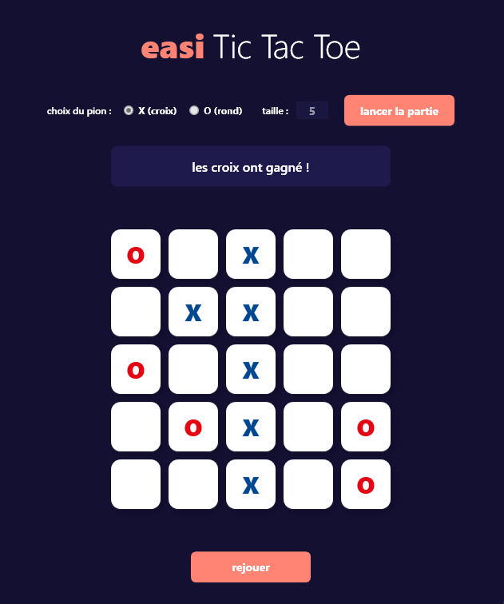

# Tic-Tac-Toe - Test technique EASI

Voici mon rendu pour le test technique du Tic-Tac-Toe. J'ai réalisé ce projet en C# avec WPF pour l'interface graphique. L'objectif était de concevoir une application robuste, lisible et intuitive.

## Technologies utilisées

* **Langage :** C#
* **Framework UI :** WPF (Windows Presentation Foundation)
* **Architecture :** Séparation Logique/Vue (inspiration MVVM)

## Fonctionnalités ajoutées

Afin d'enrichir le projet, j'ai implémenté les éléments suivants :

* **Design personnalisé :** Intégration de la charte graphique d'EASI (Bleu et Rouge) au sein d'une interface claire et moderne.
* **Taille de grille dynamique :** La taille de la grille est paramétrable par l'utilisateur (ex: 5x5, 10x10). L'interface s'adapte automatiquement et ajuste dynamiquement la taille de la police pour maintenir une lisibilité optimale.
* **Séparation des responsabilités :** Séparation stricte entre la logique métier (`GameEngine`, `Board`) et l'interface visuelle (`MainWindow.xaml`), respectant ainsi les bonnes pratiques de développement pour faciliter la maintenance.

## Instructions d'exécution

Prérequis : Le SDK .NET doit être installé sur votre poste.

### Option 1 : Via le terminal

1. Ouvrez votre terminal à la racine du projet (à l'emplacement du fichier `.sln`).
2. Exécutez la commande suivante :
    ``dotnet run``

### Option 2 : Via Visual Studio

1. Ouvrez le fichier `TicTacToe.slnx` avec Visual Studio.
2. Définissez `TicTacToe.Desktop` comme projet de démarrage.
3. Lancez l'application (touche `F5` ou bouton "Démarrer").

## Architecture du projet

Le code est structuré de la manière suivante :

    ├── Models/
    │   ├── GameEngine.cs      # Logique métier et gestion des tours
    │   └── Board.cs           # Grille et vérification des victoires
    ├── Enums/
    │   └── GameState.cs       # Etats de la partie
    │   └── CellState.cs       # Etats des cases
    ├── MainWindow.xaml        # Structure de l'interface utilisateur
    └── MainWindow.xaml.cs     # Evénements et mise à jour de l'affichage

## Perspectives d'évolution

Si le projet devait être amené à évoluer, voici les points sur lesquels je me serais concentré en priorité :

* Implémentation de tests unitaires (xUnit ou NUnit) pour garantir la fiabilité et la non-régression du moteur de jeu.
* Ajout d'un mode "Joueur contre Ordinateur" intégrant une intelligence artificielle basique (algorithme Minimax).
* Mise en place d'un système de sauvegarde des scores ou d'un historique des parties.